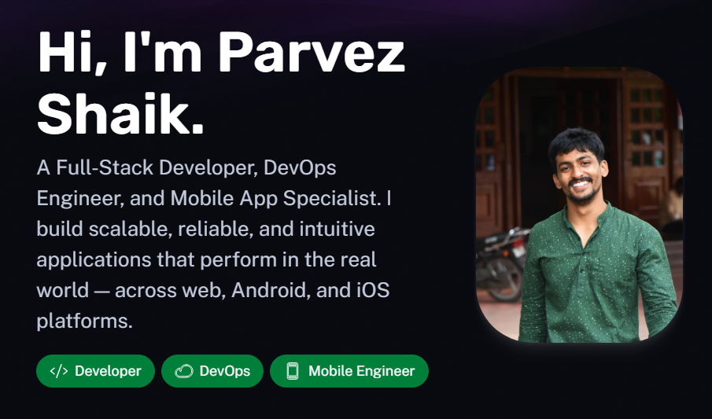
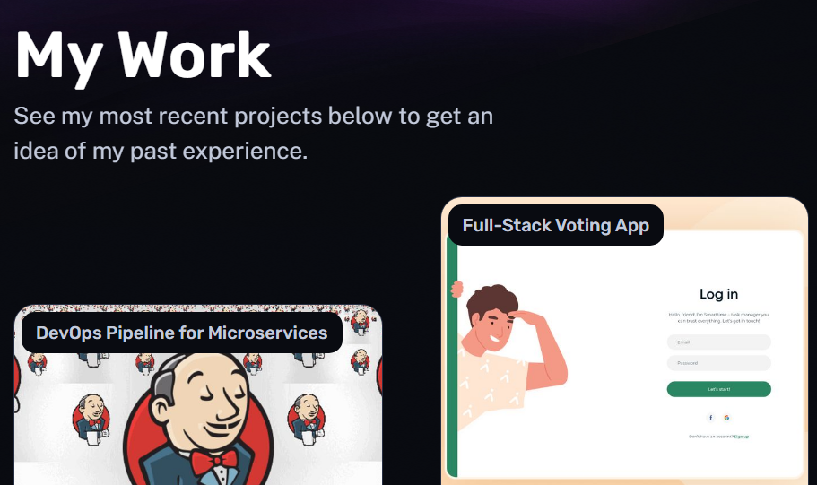

# 💼 Parvez Shaik — Developer Portfolio

Welcome to the personal portfolio of **Parvez Shaik**, a Full-Stack Software Engineer, DevOps practitioner, and Mobile App Developer (Android/iOS). This website showcases selected projects, skills, and background using a fast, modern, and responsive tech stack powered by **Astro**.

## 🚀 Live Demo

🌐 [View the Portfolio](https://parvez-shaik.vercel.app/)

---

## 🛠 Tech Stack

- **Framework**: [Astro](https://astro.build/)
- **Languages**: HTML, CSS, JavaScript, Markdown
- **Styling**: CSS Variables, Custom Components
- **Icons**: Phosphor Icons (SVG optimized)
- **Hosting**: [Vercel](https://vercel.com)

---

## 📁 Features

- ⚡ Blazing fast static site with Astro
- 📱 Fully responsive (Desktop + Mobile)
- 🧑‍💼 About section with experience & education
- 🛠 Skills categorized by area (Full-Stack, DevOps, Mobile)
- 💻 Featured projects with tags and markdown content
- 🌗 Light/Dark theme with custom tech-inspired colors
- 🔗 Social/contact section for networking
- 🧾 Clean and semantic HTML for SEO optimization

---

## 📸 Screenshots




---

## 📂 Folder Structure

```bash
├── public/                # Static assets (images, icons)
├── src/
│   ├── components/        # Reusable UI components
│   ├── layouts/           # Layout wrappers
│   ├── pages/             # Route-based pages
│   ├── content/           # Projects written in markdown
│   └── styles/            # Global CSS and variables
├── astro.config.mjs       # Astro config
├── package.json           # NPM dependencies and scripts
└── README.md              # You’re here!


# 1. Clone the repo
git clone https://github.com/Parvez-shaik/Parvez_Shaik.git
cd portfolio

# 2. Install dependencies
npm install

# 3. Start local dev server
npm run dev
